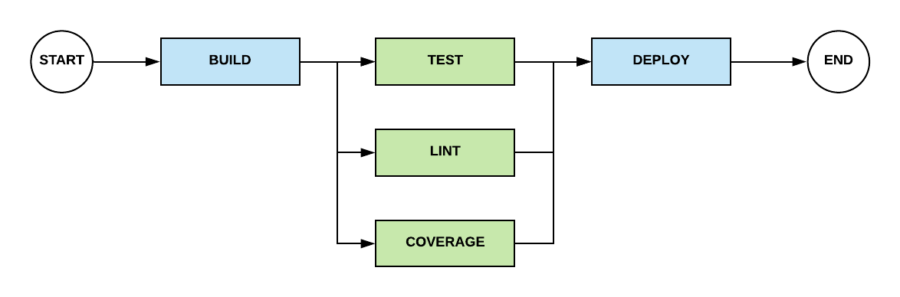
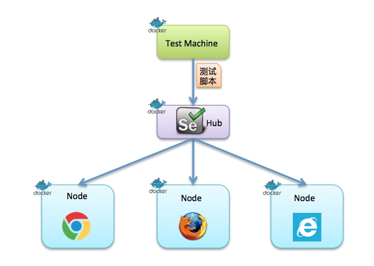
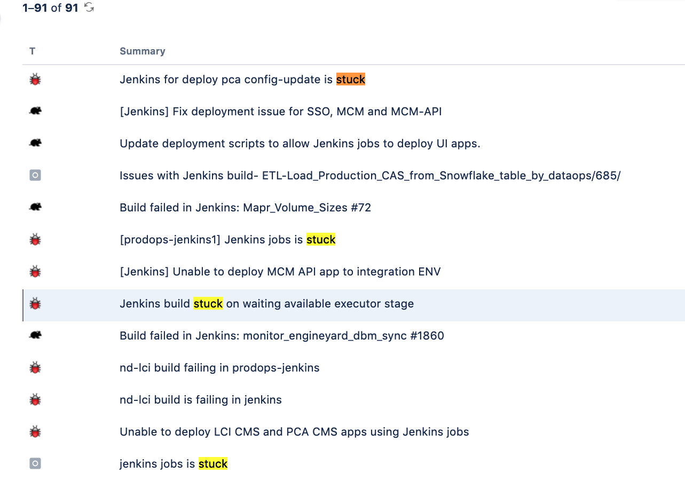
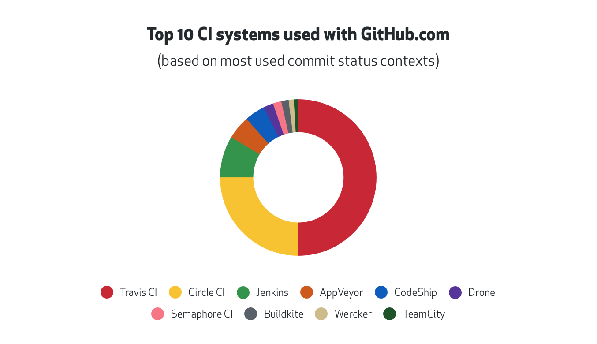
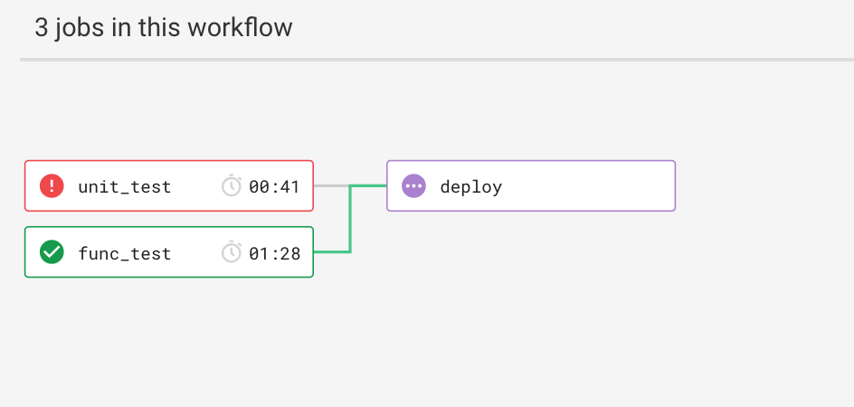
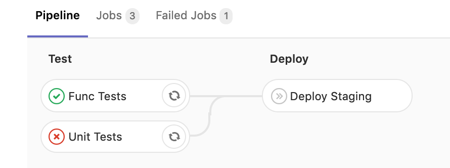
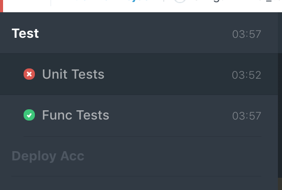
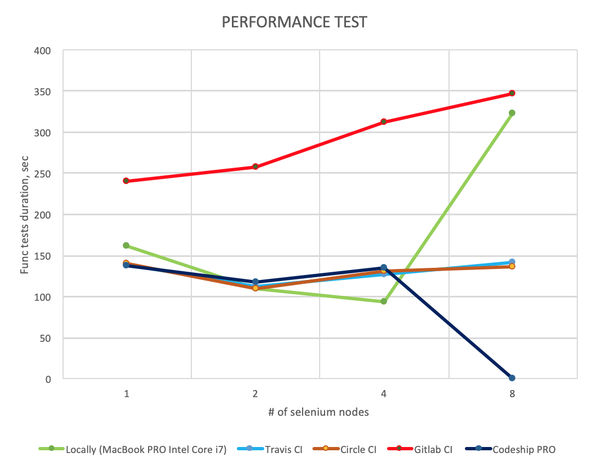

# Popular cloud-based CI/CD tools

Ilgam Shakirov

https://t.me/ishakirov

## Terminology

Continuous Integration (CI) - is the practice of merging all developer working copies to a shared mainline several times a day.

Continuous deployment (CD) - is a software engineering approach in which software functionalities are delivered frequently through automated deployments.

## Goal

## Under the hood

* __App__: containerized Django app
* __Functional Tests:__ docker-selenium
* __Deploy:__ Heroku Container Registry & Runtime

## docker-selenium
Repo: https://github.com/SeleniumHQ/docker-selenium/

src: https://blog.csdn.net/chengly0129/article/details/68940720

## Why cloud tools matters?
We like Jenkins. But sometimes it sucks...

## Available options
CI tools in GitHub marketplace

src: https://github.blog/2017-11-07-github-welcomes-all-ci-tools/

## Basic features

|                               | Travis CI | Circle CI | Gitlab CI | Codeship   |
| ----------------------------- | --------- | --------- | --------- | ---------- |
| encrypt environment variables | ✅ via ui | ✅ via ui | ❌        | ✅ via cli |
| mask secrets in logs          | ✅        | ❌        | ❌        | ❌         |
| ability to hide logs          | ?         | ✅        | ✅        | ✅         |
| run CI/CD  pipeline locally   | ❌        | ❌        | ❌        | ✅         |
| Kubernetes Deployments        | ✅        | ✅        | ✅        | ✅         |

## Pricing

1. Public Repos
1. Private Repos
    * Free plan
    * Minimal plan with unlimited builds

## CASE 1. Public Repos

|                             | Travis CI | Circle CI           | Gitlab CI            | Codeship |
| --------------------------- | --------- | ------------------- | -------------------- | -------- |
| Free plan                   | ✅        | ✅                  | ✅                   | ✅       |
| without time limits         | ✅        | 1'000 min/month     | 50'000 minutes/month | ✅       |
| Minimal plan without limits | -         | $50/container/month | -                    | -        |
| # of concurrent jobs        | 1         | 1 + 3               | fair usage algorithm | 1        |
| Personal runners            | shared    | ✅ personal         | shared               | ✅       |

## CASE 2. Private Repos

__Free plan__

|           | Travis CI | Circle CI       | Gitlab CI             | Codeship         |
| --------- | --------- | --------------- | --------------------- | ---------------- |
| Free plan | ❌ *      | ✅              | ✅                    | ✅               |
| Limits    | n/a       | 1'000 min/month | 2'000 min/group/month | 100 builds/month |

__Minimal plan with unlimited builds__

|                      | Travis CI   | Circle CI           | Gitlab CI              | Codeship  |
| -------------------- | ----------- | ------------------- | ---------------------- | --------- |
| Plan name            | "Bootstrap" | -                   | "Silver"               | "Small"   |
| Price                | $69/month   | $50/container/month | $19/user/month         | $75/month |
| Limits               | -           | -                   | 10'000 min/group/month | -         |
| # of concurrent jobs | 1           | 2+                  | ???                    | 1         |

\* Free for students

## Pipelines

|                                    |                                     |
| ---------------------------------- | ----------------------------------- |
| Travis CI  | Circle CI   |
| Gitlab CI  | Codeship  |

## Travis

__Executor Types__
* Ubuntu VM (Xenial, Trusty, Precise) --- _my choice_
* macOS VM
* Windows Server VM
* Multiple Operating Systems

## Circle CI

__Executor Types__
* Remote Docker
* Linux VM --- _my choice_
* macOS

## Gitlab CI

__Executor Types__
* SSH
* Shell
* Parallels
* VM Executor (VirtualBox/Parallels)
* Docker --- _my choice_
* Docker Machine (w/ auto-scaling)
* Kubernetes

__Platforms__
* Windows, Linux, OSX, FreeBSD

## Codeship Pro

__Executor Types__
* Docker Executor

## Current Infrastructure Overview

|                | Travis CI    | Circle CI                | Gitlab CI       | Codeship                  |
| -------------- | ------------ | ------------------------ | --------------- | ------------------------- |
| Executor Type  | Ubuntu  VM   | Linux VM                 | Docker Executor | Docker Executor ("Small") |
| Cores          | 2            | 2 (Intel Xeon(R) 2.3GHz) | ???             | 2                         |
| HD             | ~18 GB       | 100 GB                   | ???             | 10 GB                     |
| RAM            | 7.5 GB       | 8 GB                     | ???             | 3.75 GB                   |
| Boot time      | 20-50 s      | 30-60 s                  | ???             | ???                       |
| Infrastructure | Google Cloud | Google Cloud             | Google Cloud    | AWS EC2                   |

## Performance test results

## Conclusion

- __Travis__
    - ✅ nice UI
    - ✅ stable builds
    - ✅ able to check pipeline status directly in GitHub
    - ✅ super easy to setup dockerized apps
- __Circle CI__
    - ✅ nice UI
    - ✅ stable builds
    - ✅ easy to setup dockerized apps
    - ✅ / ⚠️ Each step has his own check mark in popup near the commit
    - ⚠️ Pipeline diagram is not easy to reach
- __Gitlab CI__
    - ✅ nice UI
    - ✅ stable builds
    - ⚠️ slow shared runners
    - ✅ easy to setup your own self-hosted runners
- __Codeship__
    - ✅ nice UI
    - ✅ stable builds
    - ⚠️ unable to call `docker` and `docker-compose` directly
    - ⚠️ unable to use configs, predefined in `docker-compose.yml`
    - ⚠️ performance problems when orchestrate large number of containers

## Thank you!

[Example repository](https://github.com/shilgam/ci_tools)

Ilgam Shakirov

https://t.me/ishakirov
