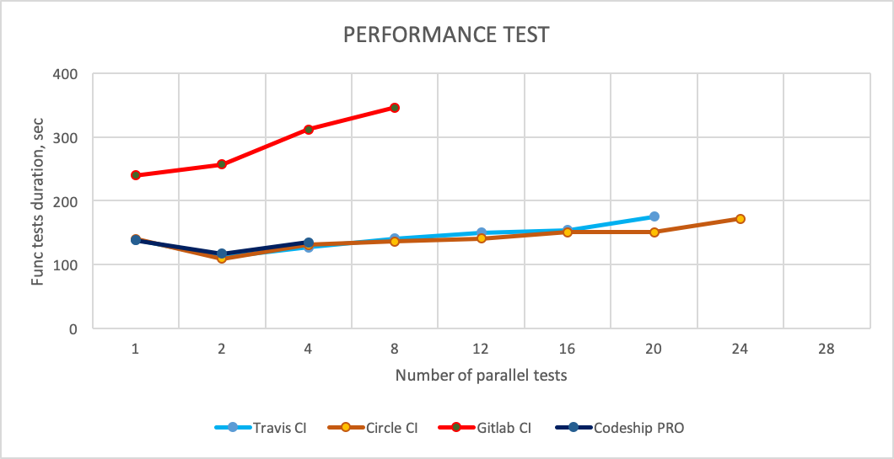

# Popular cloud-based CI/CD tools

Ilgam Shakirov

## Content
* What is CI/CD?
* Popular tools
* Benefits of using cloud-based tools
* Review aspects of using with docker
* Positive and negative sides of each tool

## What is CI/CD?

* Concepts in CI/CD
    - CI
        - small code changes
        - frequent merges
    - CD
        - To be always ready to release

* High level of automation required

Top 10 CI tools used with GitHub.com. Dec/2017

src: https://github.blog/2017-11-07-github-welcomes-all-ci-tools/

Top 10 CI tools ranked by the # of companies that use tool. May/2019

src: https://stackshare.io/continuous-integration

## Benefits of cloud-based tools

* Easy to setup
* No need pain of installing and maintaining physical servers
* Often free for Open Source products
* High availability (SLA)

## We will compare following CI tools:
- Travis
- Circle CI
- Gitlab CI
- Codeship Pro

## Pricing for Public Repos

|                             | Travis    | Circle CI           | Gitlab CI            | Codeship Pro |
| --------------------------- | --------- | ------------------- | -------------------- | ------------ |
| Free plan                   | ✅        | ✅                  | ✅                   | ✅           |
| without time limits         | ✅        | 1'000 min/month     | 50'000 minutes/month | ✅           |
| Minimal plan without limits | -         | $50/container/month | -                    | -            |
| # of concurrent jobs        | 1         | 1 + 3               | fair usage algorithm | 1            |

## Pricing for Private Repos

|                      | Travis    | Circle CI           | Gitlab CI             | Codeship         |
| -------------------- | --------- | ------------------- | --------------------- | ---------------- |
| Free plan            | ❌ *      | ✅                  | ✅                    | ✅               |
| Limits               | n/a       | 1'000 min/month     | 2'000 min/group/month | 100 builds/month |
| minimal price        | $69/month | $50/container/month | $19/user/month        | $75/month        |
| # of concurrent jobs | 1         | 2+                  | ???                   | 1                |

\* free for students

## Simple setup
1. Sign in
1. Choose repository
1. Define config file
1. Run build

## Basic features
|                             | Travis         | Circle CI | Gitlab CI | Codeship   |
| --------------------------- | -------------- | --------- | --------- | ---------- |
| store secrets in safe       | ✅ via ui, cli | ✅ via ui | ❌        | ✅ via cli |
| mask secrets in logs        | ✅             | ❌        | ❌        | ❌         |
| ability to hide logs        | ?              | ✅        | ✅        | ✅         |
| run CI/CD  pipeline locally | ❌             | ❌        | ✅        | ✅         |
| availability (SLA)          | 98,6%          | ??        | ??        | ??         |

## Benefits of using Docker for CI

* __Toolset:__
    * Docker - set of tools for developing and delivering software in packages called containers
    * docker-compose - is an orchestration tool
* __Benefits for CI:__
    * build and run your environment with a single command
    * repeatable environments

## Aspects of using Docker for CI
|                             | Travis | Circle CI | Gitlab CI | Codeship |
| --------------------------- | ------ | --------- | --------- | -------- |
| Support docker-compose      | ✅     | ✅        | ✅        | ❌       |
| Docker layer caching | ❌     | ⚠️ *      | ⚠️ **     | ✅       |
| Runner Type                 | shared | personal  | both      | personal |
| Kubernetes Deployments      | ✅     | ✅        | ✅        | ✅       |

* \* - available for an additional fee
* \*\* - not available for shared runners

Executor Types
* Travis
    * __Ubuntu VM__ (Xenial, Trusty, Precise) -- __selected option__
    * macOS VM
    * Windows Server VM
    * Multiple Operating Systems
* Circle CI
    * Remote Docker
    * __Linux VM__ -- __selected option__
    * macOS
* Gitlab CI
    * SSH /Shell
    * Parallels
    * VM Executor (VirtualBox/Parallels)
    * __Docker__ / Docker Machine (w/ auto-scaling) -- __selected option__
    * Kubernetes
* Codeship Pro
    * __Docker Executor__ -- __selected option__

## Current Infrastructure Overview

|                | Travis       | Circle CI                | Gitlab CI       | Codeship Pro              |
| -------------- | ------------ | ------------------------ | --------------- | ------------------------- |
| Executor Type  | Ubuntu  VM   | Linux VM                 | Docker Executor | Docker Executor ("Small") |
| Cores          | 2            | 2 (Intel Xeon(R) 2.3GHz) | 1 *             | 2                         |
| Disk space     | ~18 Gb       | 100 Gb                   | ???             | 10 Gb                     |
| RAM            | 7.5 Gb       | 8 Gb                     | ~3.6 Gb *       | 3.75 Gb                   |
| Boot time      | 20-50 s      | 30-60 s                  | ???             | ???                       |
| Infrastructure | Google Cloud | Google Cloud             | Google Cloud    | AWS EC2                   |

* \* - for shared runners

## Performance test

Repo: https://github.com/SeleniumHQ/docker-selenium/

## Performance test results

src: https://blog.csdn.net/chengly0129/article/details/68940720

## Conclusion

- __Travis__
    - ✅ always free for open source projects
    - ✅ super easy to setup dockerized apps
- __Circle CI__
    - ✅ easy to setup dockerized apps
    - ✅ Docker layer caching support for additional fee
- __Gitlab CI__
    - ⚠️ slow shared runners
    - ✅ easy to setup your own self-hosted runners
    - ✅ free self-hosted GitLab CE available
- __Codeship__
    - ✅ always free for open source projects
    - ⚠️ unable to call `docker` and `docker-compose` directly
    - ✅ Docker layer caching support for additional fee
    - ⚠️ performance problems for large number of containers
    - Good for small projects

## Thank you!

ILGAM SHAKIROV

Telegram: https://t.me/ishakirov

Example repo: https://github.com/shilgam/ci_tools

## Pipelines
|                                    |                                     |
| ---------------------------------- | ----------------------------------- |
| Travis  | Circle CI   |
| Gitlab CI  | Codeship  |

### Gitlab CI features
Environments and deployments

img src: https://code.uplex.de/help/ci/environments.md

### Gitlab CI features
Manual actions

img src: https://webcaptioner.com/blog/2017/12/deploy-from-gitlab-to-aws-fargate/
