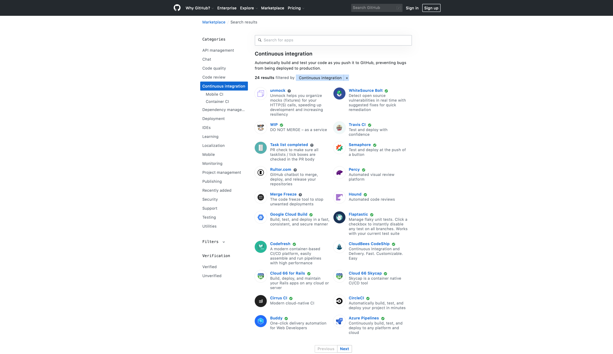
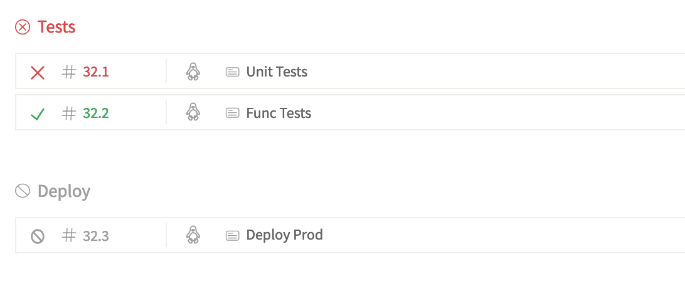

# Popular cloud-based CI/CD tools

Ilgam Shakirov


## Content
* intro to CI/CD
* Most popular CI/CD tools
* Benefits of using cloud-based tools
* Minimal setup for containerized apps
* Compare features


## What is CI/CD?

### CI ensures all changes will integrate

### CD is developing to release any time


CI tools in GitHub marketplace



## What are the most popular CI/CD tools?


Top 10 CI tools used with GitHub.com. Dec/2017


src: https://github.blog/2017-11-07-github-welcomes-all-ci-tools/


Top 10 tools in the CI category ranked by the number of companies that use tool in their tech stacks. May/2019


src: https://stackshare.io/continuous-integration


## Why cloud-based tools?

pain of installing and maintaining physical servers


## We will compare following CI tools:
- Travis
- Circle CI
- Gitlab CI
- Codeship Pro


## Pricing

* Public Repos
* Private Repos


## Pricing for Public Repos

|                             | Travis CI | Circle CI           | Gitlab CI            | Codeship Pro |
| --------------------------- | --------- | ------------------- | -------------------- | ------------ |
| Free plan                   | ✅        | ✅                  | ✅                   | ✅            |
| without time limits         | ✅        | 1'000 min/month     | 50'000 minutes/month | ✅           |
| Minimal plan without limits | -         | $50/container/month | -                    | -            |
| # of concurrent jobs        | 1         | 1 + 3               | fair usage algorithm | 1            |


## Pricing for Private Repos

__Free plan__

|           | Travis CI | Circle CI       | Gitlab CI             | Codeship         |
| --------- | --------- | --------------- | --------------------- | ---------------- |
| Free plan | ❌ *      | ✅              | ✅                    | ✅               |
| Limits    | n/a       | 1'000 min/month | 2'000 min/group/month | 100 builds/month |

__Minimal plan with unlimited builds__

|                      | Travis CI   | Circle CI           | Gitlab CI              | Codeship  |
| -------------------- | ----------- | ------------------- | ---------------------- | --------- |
| Plan name            | "Bootstrap" | -                   | "Silver"               | "Small"   |
| Price                | $69/month   | $50/container/month | $19/user/month         | $75/month |
| Limits               | -           | -                   | 10'000 min/group/month | -         |
| # of concurrent jobs | 1           | 2+                  | ???                    | 1         |

\* Free for students


## Pipelines


## Pipelines

|                                    |                                     |
| ---------------------------------- | ----------------------------------- |
| Travis CI  | Circle CI   |
| Gitlab CI  | Codeship  |


## Why docker?


## Minimal setup with docker-compose

Part 1. create simple "Hello World" web app:

```
# app/helloapp.py

from flask import Flask
app = Flask(__name__)

@app.route("/")
def home():
    return "Hello, World!"

if __name__ == '__main__':
    app.run(debug=True, host='0.0.0.0')
```

```
# app/test_helloapp.py

from helloapp import app

def test_hello():
    response = app.test_client().get('/')

    assert response.status_code == 200
    assert response.data == b'Hello, World!'
```


## Minimal setup with docker-compose

Part 2. run your app inside container using docker-compose

```
# Dockerfile

FROM python:3.6.1-alpine

RUN pip install Flask \
                pytest

COPY . /usr/src/

WORKDIR /usr/src/app
```

```
# docker-compose.yml

version: '3.4'
services:
  web:
    build: .
    ports:
      - "5000:5000"
    command: ["python", "helloapp.py"]
```

* Run app:
  * `docker-compose up`

* Run tests:
  * `docker-compose run web pytest`


## Travis CI

__Executor Types__
* Ubuntu VM (Xenial, Trusty, Precise) -- __selected option__
* macOS VM
* Windows Server VM
* Multiple Operating Systems

__First build on Travis CI:__
```
# .travis.yml

services:
  - docker

jobs:
  include:
    - name: "My Awesome Tests"
      script: docker-compose run web pytest
```


## Circle CI

__Executor Types__
* Remote Docker
* Linux VM -- __selected option__
* macOS

__First build on Circle CI:__
```
# .circleci/config.yml

version: 2
jobs:
  func_test:
    machine:
      image: circleci/classic:201711-01
    steps:
      - checkout
      - run:
          name: "My Awesome Tests"
          working_directory: .
          command: docker-compose run web pytest

workflows:
  version: 2
  test_and_deploy:
    jobs:
      - func_test
```


## Gitlab CI

__Executor Types__
* SSH
* Shell
* Parallels
* VM Executor (VirtualBox/Parallels)
* Docker -- __selected option__
* Docker Machine (w/ auto-scaling)
* Kubernetes

__First build on Gitlab CI:__
```
# .gitlab-ci.yml

image:
  name: docker/compose:1.22.0
  entrypoint: ["/bin/sh", "-c"]

services:
  - docker:dind

variables:
  # instruct docker client to talk with the daemon started inside of the dind service
  DOCKER_HOST: "tcp://docker:2375"
  # improve performance for dind
  DOCKER_DRIVER: overlay2

stages:
  - test

My Awesome Tests:
  stage: test
  script:
    - docker-compose run web pytest
```

__Platforms__
* Windows, Linux, OSX, FreeBSD


## Codeship Pro

__Executor Types__
* Docker Executor

__First build on Codeship Pro:__
```
# codeship-services.yml

webapp:
  build:
    dockerfile: Dockerfile
```

```
# codeship-steps.yml

- name: My Awesome Tests
  service: webapp
  command: pytest
```


## Basic features

|                               | Travis CI | Circle CI | Gitlab CI | Codeship   |
| ----------------------------- | --------- | --------- | --------- | ---------- |
| encrypt environment variables | ✅ via ui | ✅ via ui | ❌        | ✅ via cli |
| mask secrets in logs          | ✅        | ❌        | ❌        | ❌         |
| ability to hide logs          | ?         | ✅        | ✅        | ✅         |
| run CI/CD  pipeline locally   | ❌        | ❌        | ❌        | ✅         |
| Kubernetes Deployments        | ✅        | ✅        | ✅        | ✅         |


## Current Infrastructure Overview

|                | Travis       | Circle CI                | Gitlab CI       | Codeship Pro              |
| -------------- | ------------ | ------------------------ | --------------- | ------------------------- |
| Executor Type  | Ubuntu  VM   | Linux VM                 | Docker Executor | Docker Executor ("Small") |
| Cores          | 2            | 2 (Intel Xeon(R) 2.3GHz) | ??? (1)         | 2                         |
| HD             | ~18 Gb       | 100 Gb                   | ???             | 10 Gb                     |
| RAM            | 7.5 Gb       | 8 Gb                     | ??? (~3.6 Gb)   | 3.75 Gb                   |
| Boot time      | 20-50 s      | 30-60 s                  | ???             | ???                       |
| Infrastructure | Google Cloud | Google Cloud             | Google Cloud    | AWS EC2                   |


## Performance test

Repo: https://github.com/SeleniumHQ/docker-selenium/


## Performance test results

src: https://blog.csdn.net/chengly0129/article/details/68940720


## Conclusion

- __Travis__
    - ✅ nice UI
    - ✅ stable builds
    - ✅ able to check pipeline status directly in GitHub
    - ✅ super easy to setup dockerized apps
- __Circle CI__
    - ✅ nice UI
    - ✅ stable builds
    - ✅ easy to setup dockerized apps
    - ✅ / ⚠️ Each step has his own check mark in popup near the commit
    - ⚠️ Pipeline diagram is not easy to reach
- __Gitlab CI__
    - ✅ nice UI
    - ✅ stable builds
    - ⚠️ slow shared runners
    - ✅ easy to setup your own self-hosted runners
- __Codeship__
    - ✅ nice UI
    - ✅ stable builds
    - ⚠️ unable to call `docker` and `docker-compose` directly
    - ⚠️ unable to use configs, predefined in `docker-compose.yml`
    - ⚠️ performance problems when orchestrate large number of containers


## Thank you!

ILGAM SHAKIROV

Telegram: https://t.me/ishakirov

Example repo: https://github.com/shilgam/ci_tools

Slides: https://shilgam.github.io/reveal.js/slides/ci_tools


# NOTES:
## Requirements
- Pricing
- ability to create declarative pipelines
- Простота эксплуатации
- Скорость
- Надежность


## What is CI/CD?

Continuous Integration (CI) - is the practice of routinely integrating code changes into the main branch of a repository, and testing the changes, as often as possible.

Continuous deployment (CD) - is a software engineering approach in which software functionalities are delivered frequently through automated deployments.
