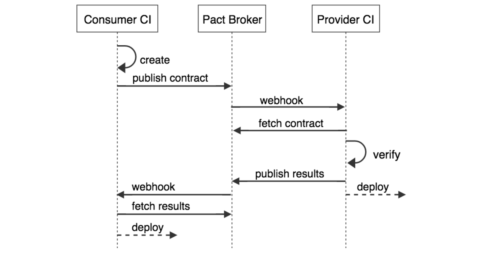

# Contract testing with pact.io

> or "Verifying Microservice Integrations with Contract Testing"

## What is contract testing?
Contract testing is a methodology for ensuring that two separate systems (such as two services) are compatible with one other.

## What is *consumer-driven* contract testing?

The "consumer-driven" prefix simply states an additional philosophical position that advocates for better internal microservices design by putting the consumers of such APIs at the heart of the design process.

> Префикс «ориентированный на потребителя» просто излагает дополнительную философскую позицию, которая отстаивает лучший дизайн внутренних сервисов, помещая потребителей таких API в центр процесса проектирования.

## What are the benefits of contract testing?

© [Practical Test Pyramid](https://martinfowler.com/articles/practical-test-pyramid.html#TheTestPyramid)

> Прежде чем обсудить преимущества контрактных тестов, обсудим какое место они занимают в пирамиде тестирования

## The problem with integration tests

Before we deploy an application to production, we need to be sure it works correctly with the other applications with which it integrates. To do this, traditionally we run integration tests using "live", deployed applications.

© https://pactflow.io/how-pact-works

> Ситуация:
- Представим, что у нас есть система из 2-х приложений, которые взаимодействуют друг с другом по REST API
- Перед деплоем одного из приложений мы хотим убедиться, что оно работает корректно в интеграции с другим приложением

## Buzzwords
- provider
- consumer
- contract

## The problem with integration tests

Integration tests
- ✅ give us confidence to release

but
- ❌ introduce dependencies
- ❌ give slow feedback
- ❌ break easily
- ❌ require lots of maintenance

> Обычно эта задачи решается созданием интеграционных тестов.
Для запуска нужно развернуть все приложения, необходимые для работы системы.

> Ver #2 of slide: https://youtu.be/-6x6XBDf9sQ?t=571

## Why not use isolated tests?

© https://pactflow.io/how-pact-works

## Why not use isolated tests?

By testing each side of an integration point using a simulated version of the other application, we get two sets of tests which

- ✅ run independently
- ✅ give fast feedback
- ✅ are stable
- ✅ are easy to maintain

but
- ❌ do not give us confidence to release.

This is because there is nothing to ensure that the simulated applications behave the same way as the real ones.

> Dev предполагает, что 2й сервис будет функционировать определенным образом. Но эти предположения никак не проверяются с реальным приложением

> Ver #2 of slide: https://youtu.be/-6x6XBDf9sQ?t=469

## Compare contract testing tools

TODO: add info

## How Pact helps - the consumer side

Testing a consumer using a Pact mock provider

Src: https://pactflow.io/how-pact-works

## How Pact helps - the provider side

Testing a provider using a Pact simulated consumer

Src: https://pactflow.io/how-pact-works

## How Pact helps

Using Pact gives you tests that

- ✅ run independently
- ✅ give fast feedback
- ✅ are stable
- ✅ are easy to maintain
- ✅ **give you confidence to release**

## TODO: example with Zoo app to show how pact works

## why consumer driven contract?

Src: https://youtu.be/h-79QmIV824?t=710

## Pact.io pros and cons

Pros:
- Simple specification by example (example request & response)
- TDD for services

Cons:
- ???? isolated build data dependency / (Isolated failure problem) ([src](https://youtu.be/h-79QmIV824?t=1868))

> Ver #2 of slide: https://youtu.be/-6x6XBDf9sQ?t=2327

## Caveats (Предостережение)
- ...
- Learning curve per pact framework
- Frameworks are WIP
- Postel's law:
    - we are very strict on what we send in request
    - but when we get response, we allow extra keys in there, so that different consumers can have different expectations of the same provider and not brake each other.
    > i.e. define in contract test only fields that you are actually using.

- provider side setup is time consuming
- Adoption essential

> Ver #2 of slide: https://youtu.be/nQ0UGY2-YYI?t=1978

## Sharing Pact files
> Ver #2 of slide: https://youtu.be/-6x6XBDf9sQ?t=1120

## Pact broker - Share pacts

Src: https://www.infoq.com/presentations/pact/ (15:50)

> How to share pact between to codebases?
> - push from one build to another repo
> - use Pact Broker - middle man between 2 projects
>     1. Consumer generate pact and publish to the broker
>     2. Provider will know url which will always give the latest pact

## Provider states
> Ver #2 of slide: https://youtu.be/-6x6XBDf9sQ?t=1655

> Как привести provider в нужное нам состояние перед отправкой реквеста?

## Closing the loop
How it works:
1. On consumer side: Publish new pact file to the Pact Broker
1. Pact Broker is configured to automatically trigger verification build on the provider side

Fully automated Solution: Swagger Validator

> Ver #2 of slide: https://youtu.be/-6x6XBDf9sQ?t=2083

## Pact Broker - Autogenerated docs

Live documentation of your contract

Src: https://www.infoq.com/presentations/pact/ (16:15)

## When to use Pact

Pact is most valuable for designing and testing integrations where:

- You (or your team/organisation) control the development of both the consumer and the provider.
- The consumer and provider are both under active development.
- The provider team can easily control the data returned in the provider's responses.
- The requirements of the consumer(s) are going to be used to drive the features of the provider.
- There is a small enough number of consumers for a given provider that the provider team can manage an individual relationship with each consumer team.

### The primary advantages are:

- You can continuously evolve your codebases knowing that Pact will guarantee contracts are met.
- You can find out before you deploy whether or not your applications will work together - there is no need to wait for slow e2e tests.

> src: https://docs.pact.io/getting_started/what_is_pact_good_for

.

## When Pact is not a good solution
- Testing APIs where the team maintaining the other side of the integration will not also being using Pact
- Testing APIs where the consumers cannot be individually identified (eg. public APIs).
Situations where you cannot load data into the provider without using the API that you're actually testing (eg. public APIs).
- Situations where you cannot control the data being used to generate the provider's responses.
- Testing new or existing providers where the functionality is not being driven or altered by the needs of particular consumers (eg. a public API or an OAuth provider where the API is completely stable)
- Testing providers where the consumer and provider teams do not have good communication channels.
- Performance and load testing.
- Functional testing of the provider - that is what the provider's own tests should do. Pact is about checking the contents and format of requests and responses.
- Testing "pass through" APIs, where the provider merely passes on the request contents to a downstream service without validating them.
- Use as a general purpose mocking or stubbing tool for browser driven tests.

> src: https://docs.pact.io/getting_started/what_is_pact_good_for

.

### Example of deployment pipeline for Consumer app

> src: https://docs.pact.io/pact_nirvana/step_4#consumer-pipeline

.

### Example of deployment pipeline for Provider app

> src: https://docs.pact.io/pact_nirvana/step_4/#provider-pipeline

.

## CI/CD and webhook configuration (#1)

> src: https://docs.pact.io/pact_broker/webhooks/#example-cicd-and-webhook-configuration

.

## CI/CD and webhook configuration (#2)

> src: https://docs.pact.io/pact_broker/webhooks/#example-cicd-and-webhook-configuration

.

## Demo

### Step 0. Initial state

### Step 1. Update contract in consumer side
- Result #1: Contract Verification started in provider side. Results successfully pushed to Pact Broker

### Step 1
- Result #2: Commit status in consumer repo updated with verification results (done by webhook in Pact Broker)

### Step 2. Fix provider to support new endpoint

- Result #1: "Normal" contract verification build started in provider repo and successfully completed.

### Step 2
- Result #2: Commit statuses in consumer repo updated with new verification result

### Step 3. Release provider

- Result: Newly released version of provider app tagged as `prod`

### Step 4. Release consumer

- Result: Newly released version of provider app tagged as `prod`

## Language support
> Ver #2 of slide: https://youtu.be/-6x6XBDf9sQ?t=2374

## Getting Started with Pact
- "Convince me" section in site  (как убедить команду)

## More info

- [Requesting new features & Roadmap](https://pact.canny.io)
- [FAQ. Convince me why to use Pact](https://docs.pact.io/faq/convinceme)
- [History of pact](https://docs.pact.io/history/)
- [Feature support of multiple implementations of Pact](https://docs.pact.io/roadmap/feature_support)
- [Talks and Presentations](https://docs.pact.io/getting_started/further_reading)
- [Tutorials & Workshops](https://docs.pact.io/implementation_guides/workshops)

## Challenges
- Setup contract tests to support authorisation
    - [description](https://github.com/pact-foundation/pact-workshop-js/tree/step8#step-8---authorization)
    - [example from pact-workshop-js](https://github.com/shilgam/pact-workshop-js/pull/12/files)
- setup release pipeline using free Pact Broker instance (instead of paid Pactflow)
- Implement webhooks to publish pact verification statuses to GitLab
- Convince the team to deploy and support single Pact Broker instance
- Modify release process (can-i-deploy script, tag released versions after release)

# END

## Цель:
- Что нам нужно сделать, чтобы быть уверенными в работоспособности системы?

Test it!
- **Isolated tests** - При необходимости Используем mocks и stabs чтобы эмулировать взаимодействие с реальными внешними сервисами.
    - Pros:
        - Быстрая обратная связь
    - Cons:
        - даже 100% покрытие не дает гарантий отсутствия ошибок
            - WHY? - поведение заменяемого сервиса со временем может измениться. Эта проблема выявится только при работе сервисов в интеграции
- **Integration tests** - Тестируем сервисы в связке
    - Pros:
        - дают гарантию работоспособности системы в целом
    - Cons:
        - slow
        - easy to break
        - hard to fix
        - Растут в геометрической прогрессии

## The problem with integration tests

|                                    |                                     |
| ---------------------------------- | ----------------------------------- |
|      |  |

Src: https://pactflow.io/how-pact-works

## Why not use isolated tests?

|                                    |                                     |
| ---------------------------------- | ----------------------------------- |
|         |  |

Src: https://pactflow.io/how-pact-works
