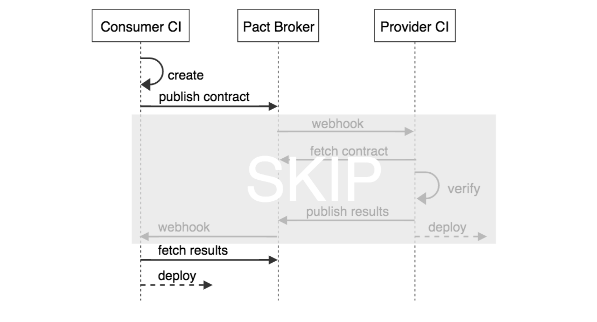
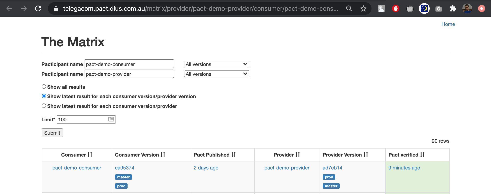

# Contract Testing with Pact


## Background


## What is Contract Testing?

Contract Testing - methodology for ensuring that two separate systems (such as two services) are compatible with one other.


© [Alexey Vinogradov](https://youtu.be/OCoKgXeNSS8?t=344)


## Contract Testing approaches

- **Provider driven**
    - tools like Swagger, etc.
- **Consumer driven**
    - consumers at the center of the design process -> better design


## Consumer-Driven Contract


© [Alexey Vinogradov](https://youtu.be/OCoKgXeNSS8)


## Reference

* [Ian Robinson, **2006**](https://martinfowler.com/articles/consumerDrivenContracts.html)


## The definition of contract
* Document schemas
* Interfaces
    * `GET /products?page=12&per_page=10`
* Conversations
    * Example: hotel booking service.  Can consumer expect the service to "remember" the details of the reservation?
* Quality of service characteristics
    * Availability, Latency, Capacity
* ???


## Contract Tests and Test Pyramid


© [Practical Test Pyramid](https://martinfowler.com/articles/practical-test-pyramid.html#TheTestPyramid)

- More integration - more problems with tests
- More integration - more confidence to release (when the tests pass)


## Contract Tests and Test Pyramid


© [Practical Test Pyramid](https://martinfowler.com/articles/practical-test-pyramid.html#TheTestPyramid)

- More integration - more problems with tests
- More integration - more confidence to release (when the tests pass)


## The problem with integration tests

|  |  |
| --- | --- |
|  |  |

© [How Pact works](https://pactflow.io/how-pact-works)


## The problem with isolated tests

|  |  |
| --- | --- |
|  |  |

© [How Pact works](https://pactflow.io/how-pact-works)


## Contract Tests - the Consumer side

Testing a consumer using a Pact mock provider


© [How Pact works](https://pactflow.io/how-pact-works)


## Contract Tests - the Provider side

Testing a provider using a Pact simulated consumer


© [How Pact works](https://pactflow.io/how-pact-works)


## How Contract Tests helps

**Contract tests gives you tests that...**

- give you confidence to release ✅
- run independently ✅
- give fast feedback ✅
- are stable ✅
- are easy to maintain ✅


## [Pact](https://pact.io)

- Pact - a family of testing frameworks (Pact-JVM, Pact Ruby, Pact .NET, Pact Go, Pact.js, Pact Swift etc.) provide support for Consumer Driven Contract Testing between dependent systems where the integration is based on HTTP (or message queues for some of the implementations).
- Pact is particularly useful for µ-services, where there can be lots of inter-dependent services and integration testing quickly becomes unfeasible.


## Pact: Supported languages

- Ruby
- JVM (Scala, Java, ect)
- Python
- .Net
- Swift
- Go
- Rust
- C++
- php
- \*\*\* [language agnostic verifier](https://docs.pact.io/getting_started/verifying_pacts/#using-a-language-that-is-not-pact-native)


## Pact: Example of contract test

```
// src/api.pact.spec.js

import path from 'path';
import { Pact } from '@pact-foundation/pact';
import { eachLike, like } from '@pact-foundation/pact/dsl/matchers';
import { API } from './api';

const mockProvider = new Pact({
  consumer: 'pact-demo-consumer',
  provider: 'pact-demo-provider',
  log: path.resolve(process.cwd(), 'logs', 'pact.log'),
  logLevel: 'warn',
  dir: path.resolve(process.cwd(), 'pacts'),
  spec: 2,
});

describe('API Pact test', () => {
  beforeAll(() => mockProvider.setup());

  afterEach(() => mockProvider.verify());

  afterAll(() => mockProvider.finalize());

  describe('getting all products', () => {
    test('products exists', async () => {
      // set up Pact interactions
      await mockProvider.addInteraction({
        state: 'products exist',
        uponReceiving: 'a request to get all products',
        withRequest: {
          method: 'GET',
          path: '/products',
        },
        willRespondWith: {
          status: 200,
          headers: {
            'Content-Type': 'application/json; charset=utf-8',
          },
          body: eachLike({
            id: like(9),
            type: like('CREDIT_CARD'),
            name: like('Gem Visa'),
          }, { min: 2 }),
        },
      });

      const api = new API(mockProvider.mockService.baseUrl);

      // make request to Pact mock server
      const product = await api.getAllProducts();

      expect(product).toStrictEqual([
        { id: 9, name: 'Gem Visa', type: 'CREDIT_CARD' },
        { id: 9, name: 'Gem Visa', type: 'CREDIT_CARD' },
      ]);
    });
  });
});
```
- Simple specification by example (example request & response)


## Example of generated contract (Pact file)

```
// pact-demo-consumer-pact-demo-provider.json

{
  "consumer": { ... },
  "provider": { ... },
  "interactions": [
    {
      "description": "a request to get all products",
      "providerState": "products exist",
      "request": {
        "method": "GET",
        "path": "/products"
      },
      "response": {
        "status": 200,
        "headers": { ... },
        "body": [
          {
            "id": 9,
            "type": "CREDIT_CARD",
            "name": "Gem Visa"
          },
          {
            "id": 9,
            "type": "CREDIT_CARD",
            "name": "Gem Visa"
          }
        ],
        "matchingRules": {
          "$.body": {
            "min": 2
          },
          "$.body[*].*": {
            "match": "type"
          },
          "$.body[*].id": {
            "match": "type"
          },
          "$.body[*].type": {
            "match": "type"
          },
          "$.body[*].name": {
            "match": "type"
          }
        }
      }
    },
    { ... }
  ],
  "metadata": { ... }
}
```


## Pact: Postel's law

Your services under test must comply with Postel's law (a.k.a. `robustness principle`):

> Be conservative in what you do, be liberal in what you accept from others

- be very strict on what you send in request
- but when you get response, you allow extra keys in there

**WHY?** Different consumers can have different expectations of the same provider and not brake each other.


## Pact: Provider states


© [Alexey Vinogradov](https://youtu.be/OCoKgXeNSS8)

* Feature is useful when response depends on the state of the provider


## Sharing Pact files


© [Atlassian](https://youtu.be/-6x6XBDf9sQ?t=1120)


## Pact Broker


Pact Broker - Web App is used for manangement of JSON pacts of all services in the system


## Pact Broker - Sharing pact files


© [Beth Skurrie - Pacts to the Rescue](https://www.infoq.com/presentations/pact)


## Pact Broker - Closing the loop

Option 1.
1. Consumer app publish new pact file to the Pact Broker
1. Pact Broker automatically trigger verification build on the provider side

Option 2
* if you are using Open API then consider using [Swagger Mock Validator plugin](https://bitbucket.org/atlassian/swagger-mock-validator) (developed at Atlassian)


## Pact Broker - Major features

* Manage contract versions


Allows to release your services independently


## Pact Broker - Major features

* **can-i-deploy** script - allows to easily setup Continuous Deployment of your services after verifying contracts


`$ pact-broker can-i-deploy --pacticipant Foo --version 23 --pacticipant Bar --version 56`

(exit code 0 means yes!)


## Pact Broker - Minor features

* Live documentation of your contract


© [Beth Skurrie - Pacts to the Rescue](https://www.infoq.com/presentations/pact)


## Pact Broker - Minor features

* Live network graph of your services


© [Beth Skurrie - Pacts to the Rescue](https://www.infoq.com/presentations/pact)


## Pact Broker - Minor features

* All operations (like creating webhooks) can be fully automated
* But is also easy to experiment (HAL browser)


## CI/CD and webhook configuration (#1)


© [docs.pact.io](https://docs.pact.io/pact_broker/webhooks/#example-cicd-and-webhook-configuration)


## CI/CD and webhook configuration (#2)



© [docs.pact.io](https://docs.pact.io/pact_broker/webhooks/#example-cicd-and-webhook-configuration)


## Pact - Primary advantages

- You can continuously evolve your codebases knowing that Pact will guarantee contracts are met
- You can find out before you deploy whether or not your applications will work together - there is no need to wait for slow e2e tests


## Advantages

- Nice [workshops](https://docs.pact.io/implementation_guides/workshops) in different languages - To grasp an idea of how it works
- Nice [CI/CD workshop](https://docs.pactflow.io/docs/workshops/ci-cd) - To understand how Pact fit into the CI/CD pipelines
- Useful [Webhooks template library](https://docs.pact.io/pact_broker/webhooks) - To automate the CI/CD process and to simplify integration with other tools.


## Downsides

- Could be hard to convince your team to use contract testing (based on experience of other teams)
- New moving parts (But this is first time complexity)
- Frameworks are WIP
    - DSLs are pretty different in different languages
    - DSLs are not mature - need to setup in different places (Example: gradle plugin of pact-jvm)
    - Not many examples on how to setup pact with recommended params
    - Support of message queues, gRPC - in progress
- Could be tricky to:
    - setup provider states
    - setup autorisation / SSL / etc
- Pact doesn't work well when communication between teams is bad


## Summary

- Not a silver bullet
- Pretty complex concepts
- Good if you have compatibility problems between Consumers/Providers
- Good if you need to reduce the time of running integration tests


## More info

- [Roadmap](https://pact.canny.io)
- [FAQ. Convince me why to use Pact](https://docs.pact.io/faq/convinceme)
- [Feature support in different languages](https://docs.pact.io/roadmap/feature_support)
- [Talks and Presentations](https://docs.pact.io/getting_started/further_reading)
- [Tutorials & Workshops](https://docs.pact.io/implementation_guides/workshops)
- Demo apps for this slides can be found here:
    - consumer app (pact-js): https://github.com/shilgam/pact-demo-consumer
    - provider app (pact-jvm): https://github.com/shilgam/pact-demo-provider


# THANK YOU!


Integration tests ...

* give us confidence to release ✅
* ~~run independently~~ ❌
* ~~give fast feedback~~ ❌
* ~~are stable~~ ❌
* ~~are easy to maintain~~ ❌


Isolated tests ...
* ~~give us confidence to release~~ ❌
* run independently ✅
* give fast feedback ✅
* are stable ✅
* are easy to maintain ✅


## Demo


### Step 0. Initial state


### Step 1. Update contract in consumer side
- Result #1: Contract Verification started in provider side. Results successfully pushed to Pact Broker


### Step 1
- Result #2: Commit status in consumer repo updated with verification results (done by webhook in Pact Broker)


### Step 2. Fix provider to support new endpoint

- Result #1: "Normal" contract verification build started in provider repo and successfully completed.


### Step 2
- Result #2: Commit statuses in consumer repo updated with new verification result


### Step 3. Release provider

- Result: Newly released version of provider app tagged as `prod`



### Step 4. Release consumer

- Result: Newly released version of provider app tagged as `prod`


## Challenges
- Setup contract tests to support authorisation
    - [description](https://github.com/pact-foundation/pact-workshop-js/tree/step8#step-8---authorization)
    - [example from pact-workshop-js](https://github.com/shilgam/pact-workshop-js/pull/12/files)
- setup release pipeline using free Pact Broker instance (instead of paid Pactflow)
- Implement webhooks to publish pact verification statuses to GitLab
- Convince the team to deploy and support single Pact Broker instance
- Modify release process (can-i-deploy script, tag released versions after release)


### Example of deployment pipeline for Consumer app


> src: https://docs.pact.io/pact_nirvana/step_4#consumer-pipeline


### Example of deployment pipeline for Provider app


> src: https://docs.pact.io/pact_nirvana/step_4/#provider-pipeline


## When to use Pact

Pact is most valuable for designing and testing integrations where:

- You (or your team/organisation) control the development of both the consumer and the provider.
- The consumer and provider are both under active development.
- The provider team can easily control the data returned in the provider's responses.
- The requirements of the consumer(s) are going to be used to drive the features of the provider.
- There is a small enough number of consumers for a given provider that the provider team can manage an individual relationship with each consumer team.
