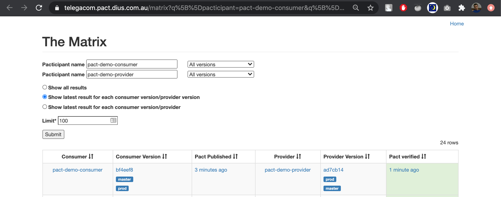

# Contract testing with pact.io

## What is contract testing?
Contract testing is a technique for testing an integration point by checking each application in isolation to ensure the messages it sends or receives conform to a shared understanding that is documented in a "contract"

> src: https://docs.pact.io/#what-is-contract-testing

## How pact works

Animated step-by-step explanation of how Pact works:
https://pactflow.io/how-pact-works/

## When to use Pact

Pact is most valuable for designing and testing integrations where:

- You (or your team/organisation) control the development of both the consumer and the provider.
- The consumer and provider are both under active development.
- The provider team can easily control the data returned in the provider's responses.
- The requirements of the consumer(s) are going to be used to drive the features of the provider.
- There is a small enough number of consumers for a given provider that the provider team can manage an individual relationship with each consumer team.

### The primary advantages are:

- You can continuously evolve your codebases knowing that Pact will guarantee contracts are met.
- You can find out before you deploy whether or not your applications will work together - there is no need to wait for slow e2e tests.

> src: https://docs.pact.io/getting_started/what_is_pact_good_for

.

## When Pact is not a good solution
- Testing APIs where the team maintaining the other side of the integration will not also being using Pact
- Testing APIs where the consumers cannot be individually identified (eg. public APIs).
Situations where you cannot load data into the provider without using the API that you're actually testing (eg. public APIs).
- Situations where you cannot control the data being used to generate the provider's responses.
- Testing new or existing providers where the functionality is not being driven or altered by the needs of particular consumers (eg. a public API or an OAuth provider where the API is completely stable)
- Testing providers where the consumer and provider teams do not have good communication channels.
- Performance and load testing.
- Functional testing of the provider - that is what the provider's own tests should do. Pact is about checking the contents and format of requests and responses.
- Testing "pass through" APIs, where the provider merely passes on the request contents to a downstream service without validating them.
- Use as a general purpose mocking or stubbing tool for browser driven tests.

> src: https://docs.pact.io/getting_started/what_is_pact_good_for

.

### Example of deployment pipeline for Consumer app

> src: https://docs.pact.io/pact_nirvana/step_4#consumer-pipeline

.

### Example of deployment pipeline for Provider app

> src: https://docs.pact.io/pact_nirvana/step_4/#provider-pipeline

.

## CI/CD and webhook configuration (#1)

> src: https://docs.pact.io/pact_broker/webhooks/#example-cicd-and-webhook-configuration

.

## CI/CD and webhook configuration (#2)

> src: https://docs.pact.io/pact_broker/webhooks/#example-cicd-and-webhook-configuration

.

## Demo

### Step 0. Initial state

### Step 1. Update contract in consumer side
- Result #1: Contract Verification started in provider side. Results successfully pushed to Pact Broker

### Step 1
- Result #2: Commit status in consumer repo updated with verification results (done by webhook in Pact Broker)

### Step 2. Fix provider to support new endpoint

- Result #1: "Normal" contract verification build started in provider repo and successfully completed.

### Step 2
- Result #2: Commit statuses in consumer repo updated with new verification result

### Step 3. Release provider

- Result: Newly released version of provider app tagged as `prod`

### Step 4. Release consumer

- Result: Newly released version of provider app tagged as `prod`

## More info

- [Requesting new features & Roadmap](https://pact.canny.io)
- [FAQ. Convince me why to use Pact](https://docs.pact.io/faq/convinceme)
- [History of pact](https://docs.pact.io/history/)
- [Feature support of multiple implementations of Pact](https://docs.pact.io/roadmap/feature_support)
- [Talks and Presentations](https://docs.pact.io/getting_started/further_reading)
- [Tutorials & Workshops](https://docs.pact.io/implementation_guides/workshops)

## Challenges
- Setup contract tests to support authorisation
    - [description](https://github.com/pact-foundation/pact-workshop-js/tree/step8#step-8---authorization)
    - [example from pact-workshop-js](https://github.com/shilgam/pact-workshop-js/pull/12/files)
- setup release pipeline using free Pact Broker instance (instead of paid Pactflow)
- Implement webhooks to publish pact verification statuses to GitLab
- Convince the team to deploy and support single Pact Broker instance
- Modify release process (can-i-deploy script, tag released versions after release)
