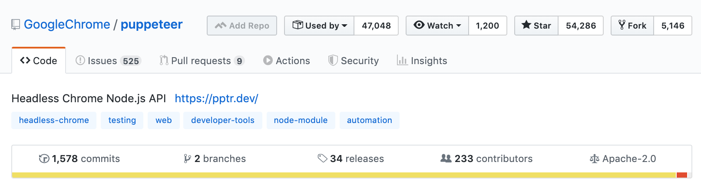
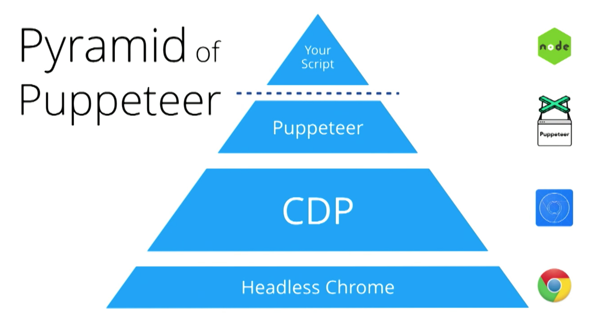
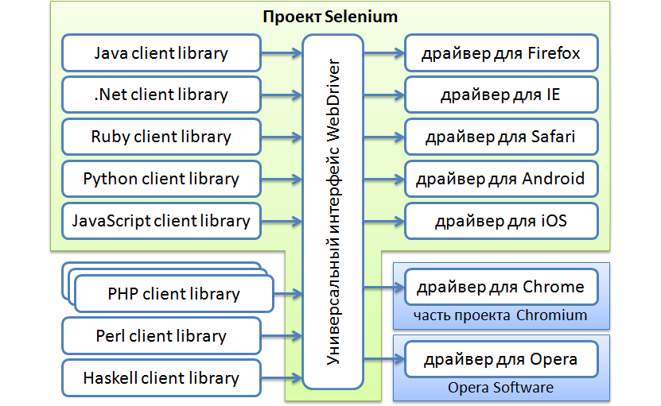
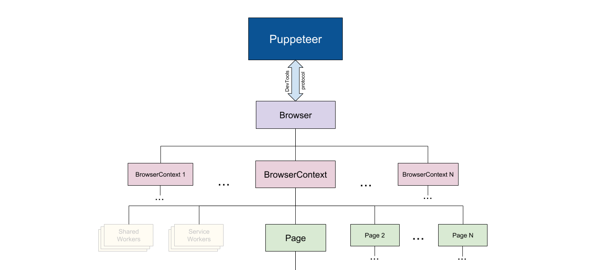
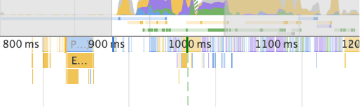
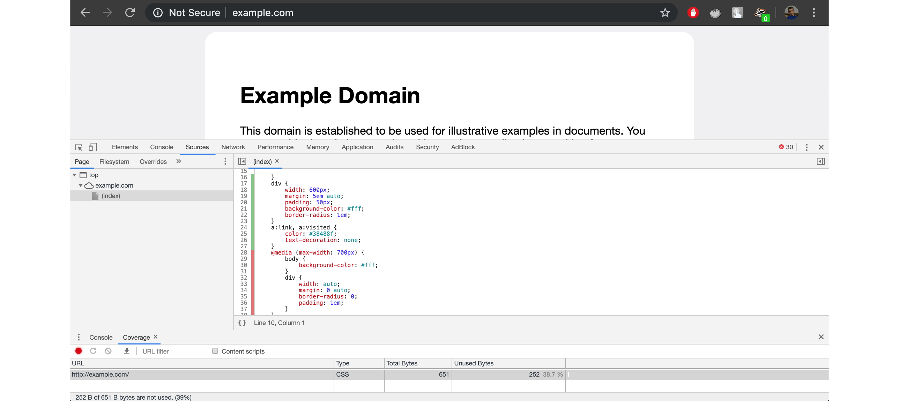
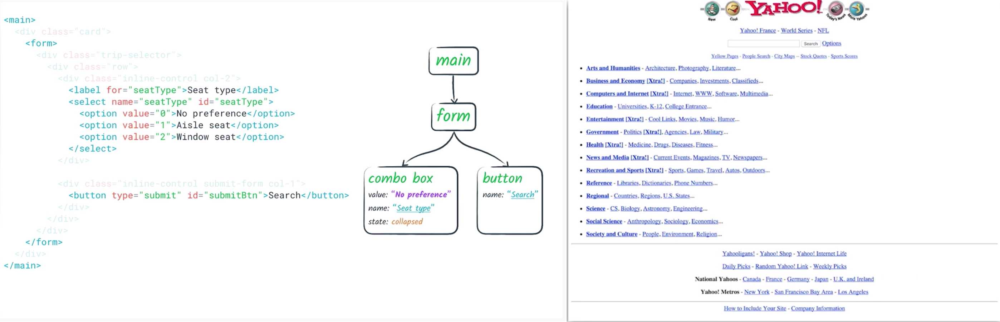
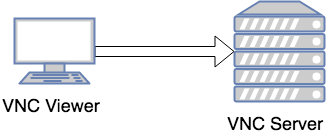
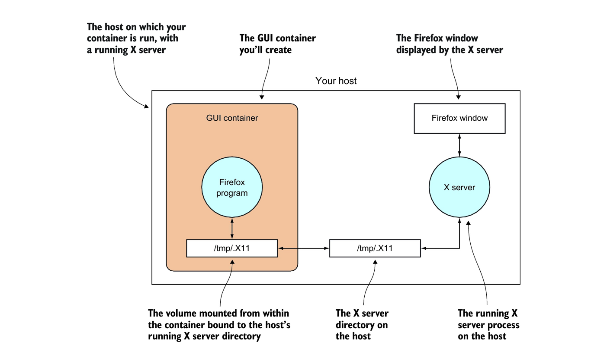

# Testing with Puppeteer
Ilgam Shakirov

### Agenda

* Chapter 1. What is puppeteer?

* Chapter 2. Running GUI apps inside Docker containers

* Chapter 3. Testing with Puppeteer

## Chapter 1. What is puppeteer?
* https://github.com/GoogleChrome/puppeteer

* Puppeteer - browser automation library

* Maintainer: Chrome DevTools team

### Companies

<small>src: https://youtu.be/qpW69uD0w8o?t=2785</small>

### How it works?

<small>src: https://youtu.be/7-XnEMrQnn4?t=1284</small>

### Puppeteer. Goals of the project
- Provide a slim, canonical library that highlights the capabilities of the DevTools Protocol.
- Provide a reference implementation for similar testing libraries. Eventually, these other frameworks could adopt Puppeteer as their foundational layer.
- Popularize headless/automated browser testing.
- Learn more about the pain points of automated browser testing.

### Puppeteer. Killer Features
1. Fast
1. Simple
1. Stable

#### Puppeteer VS Selenium WebDriver
Selenium WebDriver Architecture

<small>src: https://selenium2.ru/articles/62-what-is-selenium.html</small>

- **1. Fast**
    - Support browser contexts to launch different sessions
    
    <small>src: https://github.com/GoogleChrome/puppeteer/blob/master/docs/api.md#overview</small>
        - each context will have separate storage for cookies/cache
    - 15 times faster than Selenium

- **2. Simple**
    - Requires zero setup
    - Has straightforward API
- **3. Stable**
    - WaitFor network activity
    - WaitFor DOM modifications
    - WaitFor complete navigation

### Features
- **Emulate mobile devices**
    - More than 70 devices in the list
- **Support Offline mode**
- **Interact with Service Workers**
    - SW - script that browser runs in the background
- **Set geolocation**
- **Request interception**
    - Modify request and response on the fly
        - Modify body/header
        - Abort/Replace some request
    - Server mocking

- **Record a performance timeline**
    - DevTools "Network" panel feature

  

**Performance testing**
- Find memory leaks
- Run CSS/JS code coverage checks
  
    - Browser knows better which selectors and classes are used. Which JS/CSS code was used, and which one is not.

**Accessibility testing**
- Fetch Accessibility Tree from web pages

### Puppeteer Limitations
- Supports only:
    - Chromium, Chrome
    - Firefox (experimental, supports 90% of API)
- Audio and video
    - because of Chromium's media-related limitations
- Mobile version of Chrome are not supported
    - Example: does not support HTTP Live Streaming (HLS)
- Top-level functions are not supported:
    - Sync Bookmarks
    - Passwords
    - User profiles

### Tools around Puppeteer
- "Puppeteer Recorder" chrome extension
    - Demo: https://www.youtube.com/watch?v=CDzwbm_b7Co

- Testing framework: https://github.com/smooth-code/jest-puppeteer

- Assertion library: https://www.npmjs.com/package/expect-puppeteer

## Chapter 2. Run GUI apps inside containers

**Option 1: VNC**

**Option 2: X server**

<small>src: https://freecontent.manning.com/running-containers-tricks-of-the-trade/</small>

## Chapter 3. Testing with Puppeteer
### Features

- Generates real user input
    - Supports "trusted" and "untrusted" input events
- Headless / Headful modes
    - SlowMo - for visual debugging in Headful mode
- Cookies
    - Case: Logging in
    - Pass session cookies from one tab to another
- Virtual timer
    - Case: Virtually fast forward to skip animations
- Parallel testing
    - Jest supports parallel testing out of the box

### Problems

- Not enough built-in matchers
    - Assertion library for Puppeteer
          // Does not work if button is not in page
          await page.click('button')

          // Will try while 500ms to click on "button"
          await page.toClick('button')

          // Will match a button with a "My button" text inside
          await page.toClick('button', { text: 'My button' })
    <small>lib: https://www.npmjs.com/package/expect-puppeteer</small>

### Demo

https://github.com/shilgam/js-demo/tree/master/puppeteer

## Thank you!
